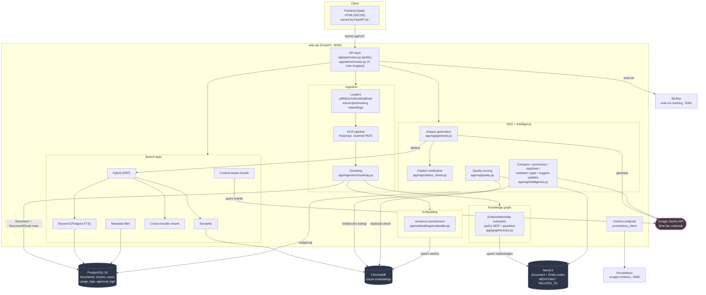
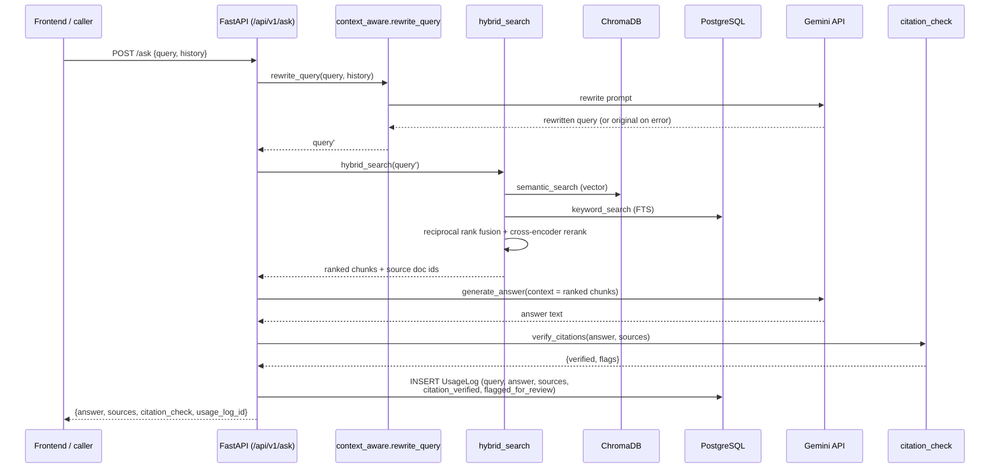
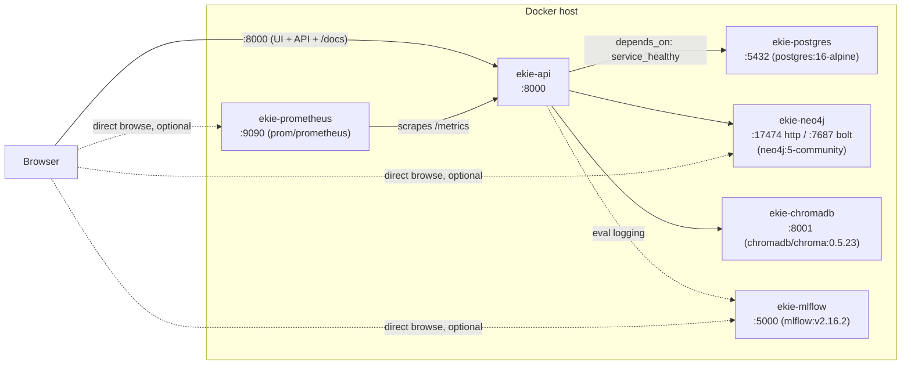

# EKIE — AI Architecture Diagram

Case-study deliverable: "AI Architecture Diagram". Companion to
`docs/knowledge_graph_schema.md` (Knowledge Graph Design) and
`docs/Database_Schema_Diagram.md` (Database Schema).

Source of truth: `docker-compose.yml` (6 services) and `app/main.py`
(router wiring). Paste any block below into mermaid.live, GitHub/GitLab
markdown preview, or the VS Code Mermaid extension to render it.

---

## 1. System component diagram

Six Docker services, one FastAPI process holding five internal pipeline
layers plus the static frontend.

**Reading the diagram:** ingestion is synchronous end-to-end — a single
`POST /admin/documents/upload` request runs loading → OCR (if needed) →
chunking → embedding → ChromaDB upsert → Postgres row insert → graph
population, and doesn't return until all of it finishes. That's a
deliberate simplicity trade-off (see README "Scope decisions" — no queue,
no Celery/background worker) that keeps the demo predictable at the cost
of upload latency on large documents.

---

## 2. Request-flow sequence: `POST /ask` (RAG with citations)

The most architecturally interesting request — it touches every store and
the one external dependency (Gemini).

Failure modes explicitly handled at this layer (see `app/api/routes.py`):
Gemini `429` (quota exceeded) → `HTTP 429` with a clear detail message;
Gemini timeout → `HTTP 504`; `context_aware.rewrite_query` failure → falls
back to the original, unrewritten query rather than failing the whole
request.

---

## 3. Deployment topology (docker-compose.yml)

All six services start with one `docker compose up --build`. `api`
declares `depends_on: postgres (service_healthy), neo4j (service_healthy),
chromadb (service_started)`; `app/main.py` additionally retries its own
Postgres schema init and Neo4j constraint setup on startup (10 attempts,
3s backoff) as a second safety net against boot-order races — see the
comments at the top of `app/main.py` for why both layers exist (Neo4j is
a JVM app and can take 10-20s past its own "started" log line before
accepting Bolt connections).

---

## 4. Why these technology choices (brief, full detail in README)

| Layer | Choice | Why |
|---|---|---|
| Vector store | ChromaDB | Simplest of the three suggested options (Chroma/Pinecone/Weaviate) to self-host with zero external account/API key, fits a 5-week case study. |
| Knowledge graph | Neo4j | Only graph DB in the suggested list; Cypher's pattern-matching fits `RELATES_TO`/`MENTIONS` traversal directly. |
| Keyword search | Postgres FTS (GIN index) | Avoids standing up a 4th datastore (Elasticsearch/OpenSearch) for search modes that overlap heavily with what Postgres already does well at this corpus size. |
| Reranking | Local cross-encoder (`ms-marco-MiniLM-L-6-v2`) | Free, runs in-process, no added external dependency or per-call cost on top of the already-metered Gemini calls. |
| LLM | Google Gemini (free tier) | Zero-cost for a student project; trade-off is the 20-req/day/model quota that shows up repeatedly in the Week 4 evaluation work — documented, not hidden. |
| Eval tracking | MLflow | Suggested in the case study; low-overhead self-hosted run tracking, no external account. |

---

## 5. Related documents

- `docs/knowledge_graph_schema.md` — Knowledge Graph Design (node/edge schema, constraints, derived relationship inference, example Cypher).
- `docs/Database_Schema_Diagram.md` — PostgreSQL ERD (7 tables).
- `docs/Integration_Test_Report.md` — how these components were verified to actually talk to each other correctly.
- `README.md` — Quickstart, full scope-decision rationale, known limitations.
