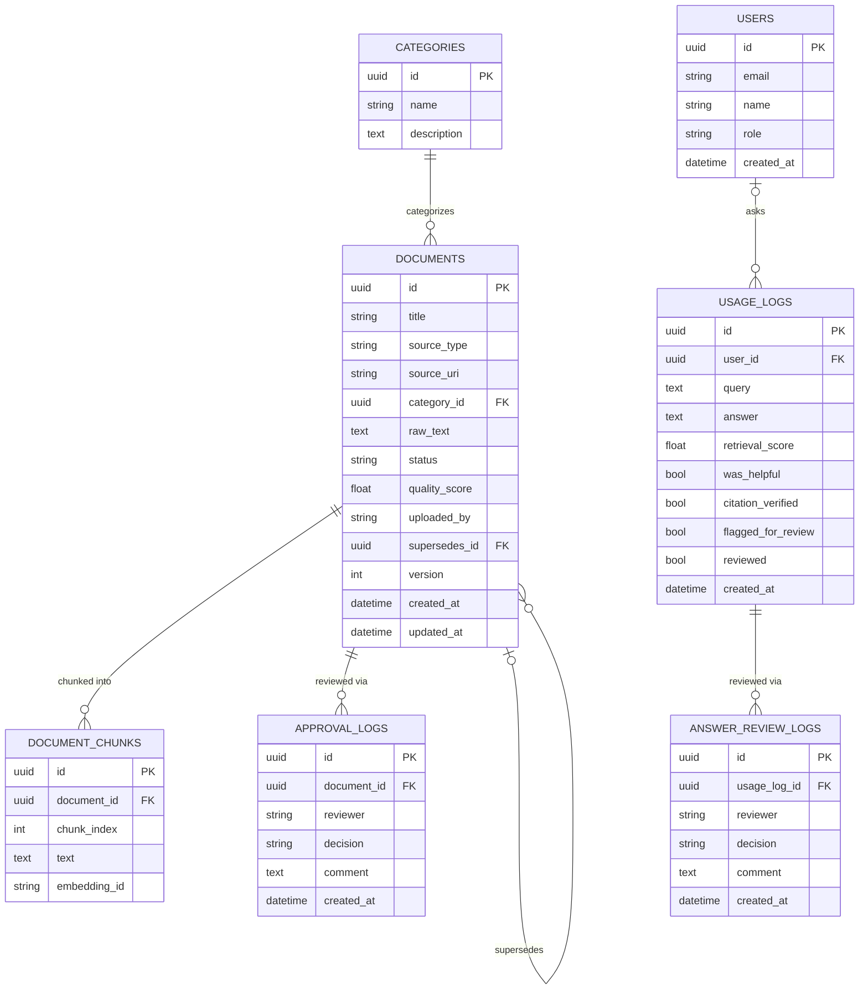

# EKIE Database Schema

Source: `app/core/models.py` (SQLAlchemy models, PostgreSQL). 7 tables.

## Entity-relationship diagram

Paste this block into any Mermaid renderer (mermaid.live, GitHub/GitLab markdown preview, VS Code Mermaid extension) to render it. It was also rendered live for the Week 4 deliverable review.

## Table notes

**categories → documents** (1:N) — every document optionally belongs to one category (`category_id` nullable).

**documents → document_chunks** (1:N) — a document is split into chunks at ingestion (`app/rag/pipeline.py::_chunk_embed_store`). Each chunk carries `embedding_id`, the id of its vector in ChromaDB — this table is the join point between Postgres and the vector store.

**documents → approval_logs** (1:N) — one append-only row per admin approve/reject decision. `documents.status` holds current state; this table is the audit trail.

**documents → documents** (self-referential, `supersedes_id`) — Bonus feature: Document Version Intelligence (`app/rag/version_intelligence.py`). A document with `supersedes_id` set is a newer version of that document; `version` increments by 1 down the chain from the root. Set explicitly via `link_version()`, never inferred automatically — `detect_version_candidates()` only suggests pairs for an admin to confirm.

**users → usage_logs** (1:N, nullable FK) — every `/ask` call is logged regardless of whether a `user_id` was supplied (anonymous queries are allowed).

**usage_logs → answer_review_logs** (1:N) — mirrors `documents → approval_logs`: one append-only row per admin review decision on an AI-generated answer. `usage_logs.reviewed` / `flagged_for_review` hold current state for cheap filtering in the admin queue; this table is the audit trail. `citation_verified` / `citation_flags` on `usage_logs` cache the output of `verify_citations()` at answer time so the review queue doesn't recompute embeddings for every historical answer.

## Indexes worth calling out

- `document_chunks.text` has a GIN full-text index (`chunks_fts_idx`, `to_tsvector('english', text)`) backing `app/search/keyword.py::keyword_search()`. Without it, keyword search would do a sequential scan + on-the-fly tsvector build on every query.
